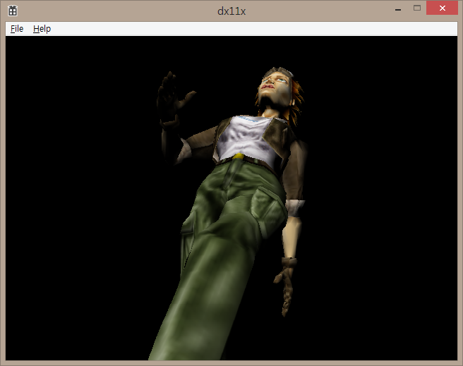
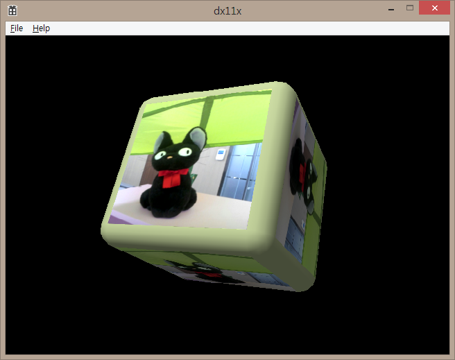

# DirectX 11 X-file Viewer

This example shows how to implement X-file skinning animation without D3DX.

## Compiling

Visual Studio 2013 community required.
Before open the solution file, type below from Git Bash to get DirectXTK.

### git submodule init
### git submodule update

That's it! Then, open dx11x.sln and build it:)

## How to use

Drag-and-Drop .x file to view. (sorry, binary .x files are not supported)
